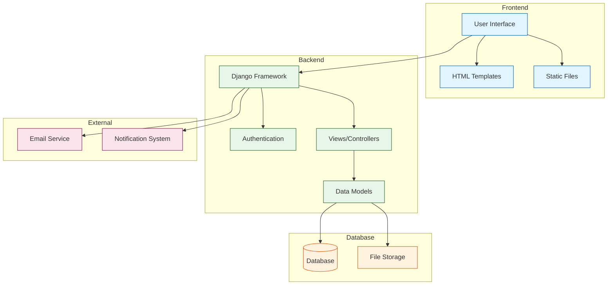

# Ticketing System Architecture

## Component Description

### Frontend Layer
- **User Interface**: Web interface for users
- **HTML Templates**: Reusable page layouts
- **Static Files**: CSS, JavaScript, and images

### Backend Layer
- **Django Framework**: Core application framework
- **Authentication**: User authentication and authorization
- **Views/Controllers**: Business logic and request handling
- **Data Models**: Database schema and relationships

### Database Layer
- **Database**: Stores application data
- **File Storage**: Manages uploaded files and attachments

### External Services
- **Email Service**: Handles email notifications
- **Notification System**: Manages system notifications 