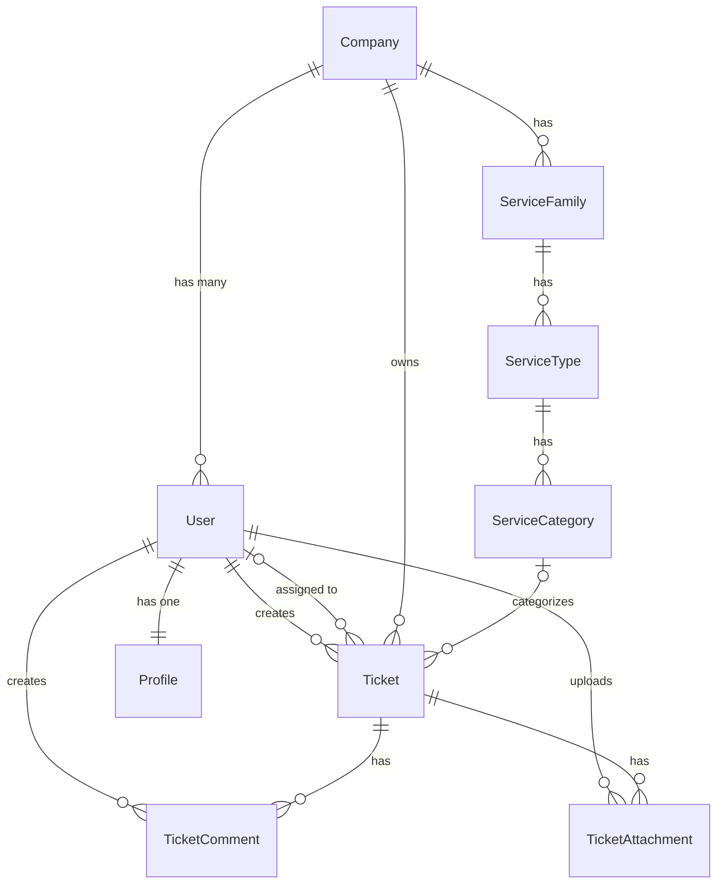
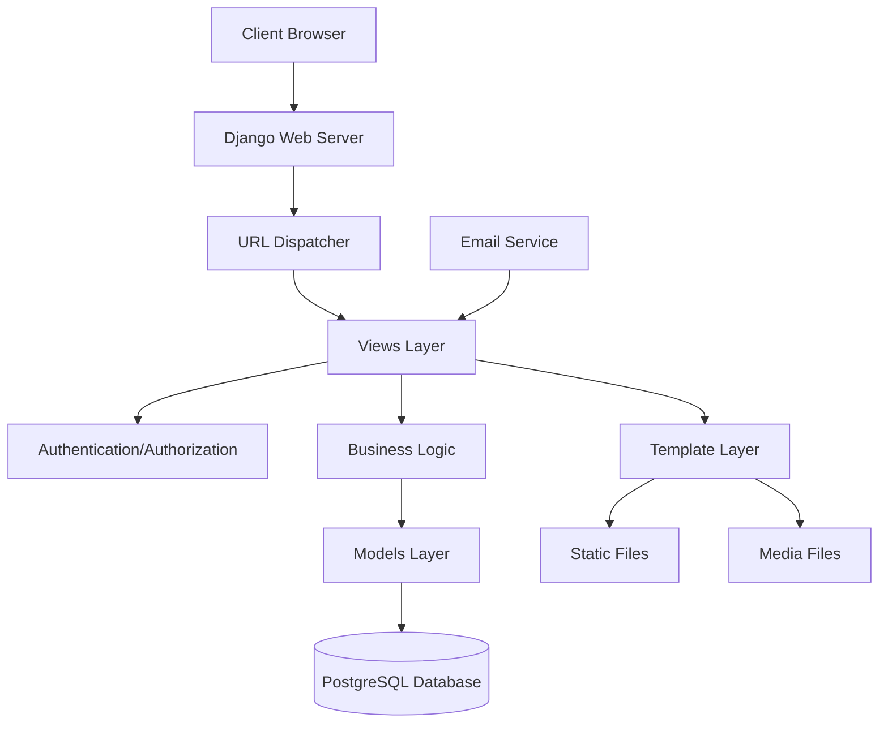

# System Diagrams

## ER Diagram

```mermaid
erDiagram
    Company ||--o{ User : "has many"
    User ||--o{ Ticket : "creates"
    User ||--o{ TicketComment : "creates"
    User ||--o{ TicketAttachment : "uploads"
    User |o--o{ Ticket : "assigned to"
    Company ||--o{ ServiceFamily : "has"
    Company ||--o{ Ticket : "owns"
    
    ServiceFamily ||--o{ ServiceType : "has"
    ServiceType ||--o{ ServiceCategory : "has"
    ServiceCategory |o--o{ Ticket : "categorizes"
    
    Ticket ||--o{ TicketComment : "has"
    Ticket ||--o{ TicketAttachment : "has"
    User ||--|| Profile : "has one"
```

## Architecture Diagram

```mermaid
graph TD
    A[Client Browser] --> B[Django Web Server]
    B --> C[URL Dispatcher]
    C --> D[Views Layer]
    D --> E[Authentication/Authorization]
    D --> F[Business Logic]
    F --> G[Models Layer]
    G --> H[(PostgreSQL Database)]
    D --> I[Template Layer]
    I --> J[Static Files]
    I --> K[Media Files]
    L[Email Service] --> D
```